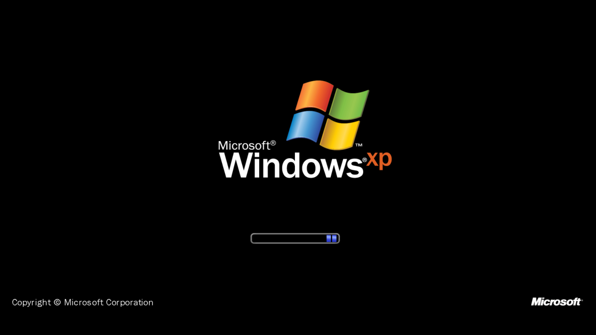
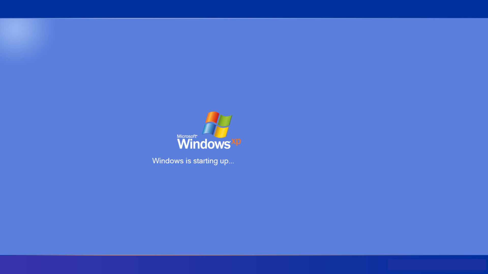
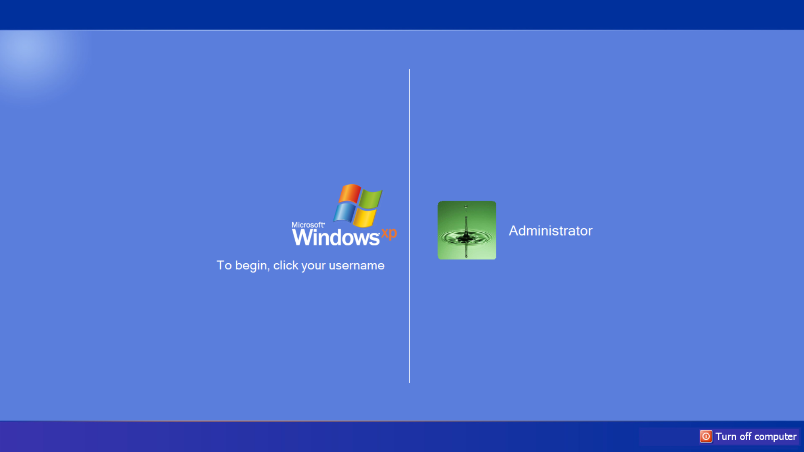
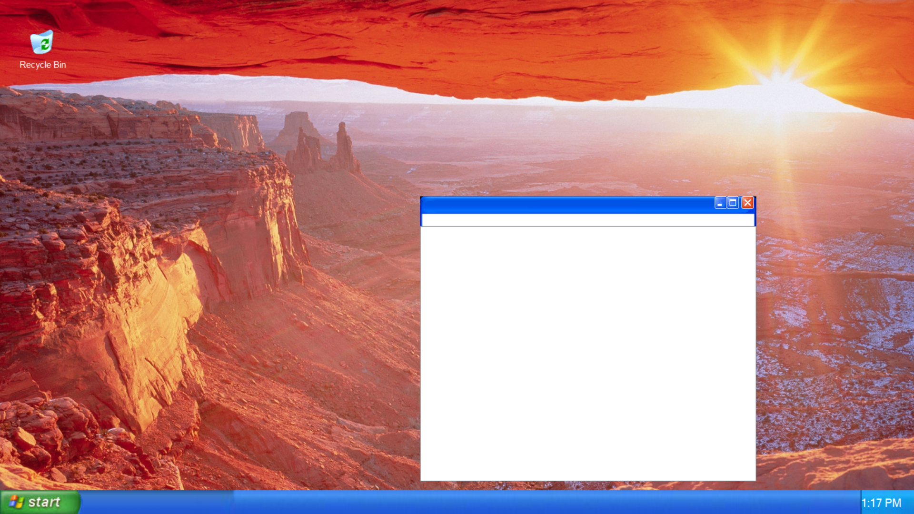
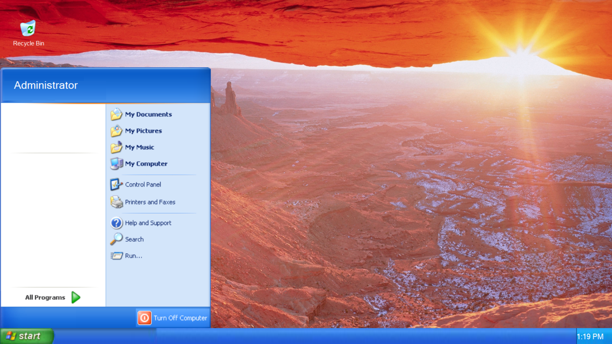
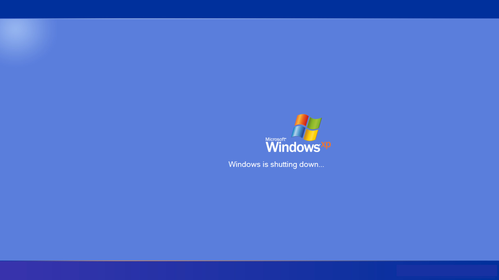

# WindowsXP
Windows XP made using C# | Runs on top of Windows | .NET 4.6.1

[Download & Patch Notes](https://github.com/BlueJay113/WindowsXP/releases/latest/)
[Source Code (Was too big for GitHub 😂](https://drive.google.com/file/d/1wRLg1hODpaf2cw8gPpDeD0AGQO9b6_-C/view)

## Screenshots

